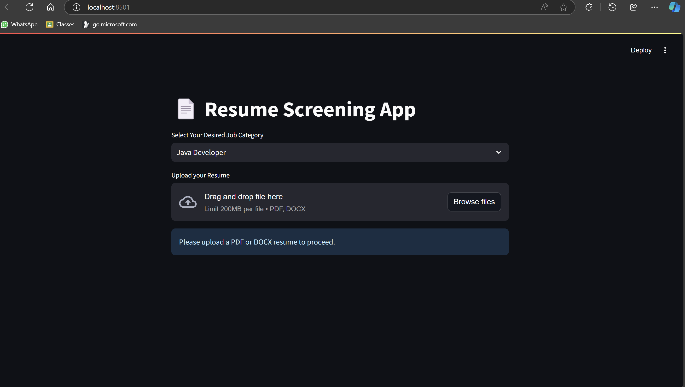
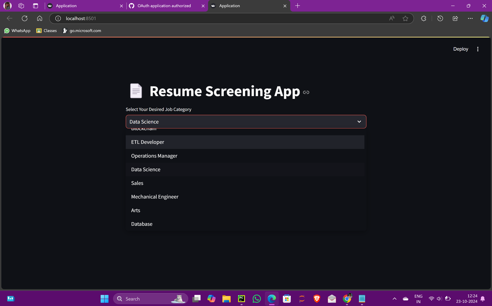
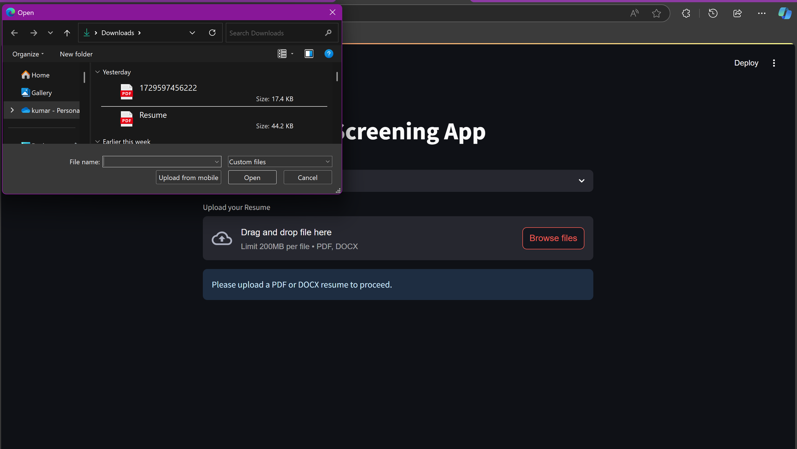
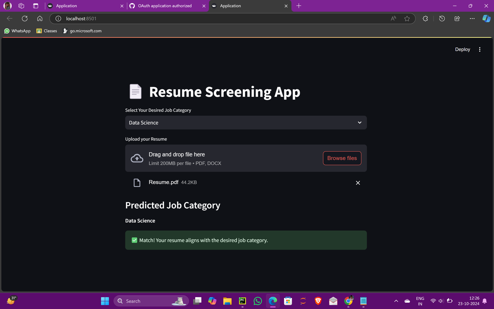
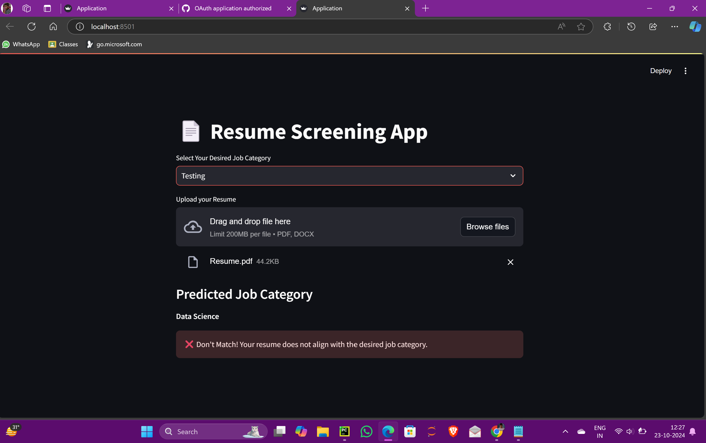

Here's the complete README code in a single block that you can copy and paste into your `README.md` file:


# Resume Screening App

## Table of Contents
- [Introduction](#introduction)
- [Technologies Used](#technologies-used)
- [Installation](#installation)
- [Usage](#usage)
- [Features](#features)
- [How it works](#How-it-works)
- [Conclusion](#conclusion)


## Introduction

The **Resume Screening App** is a web application that helps job seekers determine how well their resumes align with specific job categories. The application leverages machine learning to analyze resumes (in PDF or DOCX format) and predicts the most suitable job category based on the content of the resume.

## Technologies Used

This project is built using the following technologies:
- **Python Libraries**:
  - `nltk`: Natural Language Toolkit for text processing.
  - `numpy`: For numerical operations.
  - `pandas`: For data manipulation and analysis.
  - `streamlit`: For creating the web application.
  - `pickle`: For object serialization.
  - `sklearn`: For machine learning.
  - `PyPDF2`: For reading PDF files.
  - `docx`: For reading DOCX files.

## Installation

Follow these steps to set up the project locally:


1. **Create a Virtual Environment** (optional but recommended):
   ```bash
   python -m venv venv
   source venv/bin/activate   # On Windows use `venv\Scripts\activate`
   ```

2. **Install Required Libraries**:
   Create a `Requirements.txt` file in your project directory with the following content:
   ```
   streamlit
   PyPDF2
   python-docx
   pickle5
   nltk
   numpy
   pandas
   scikit-learn
   ```
   Then run:
   ```bash
   pip install -r Requirements.txt
   ```

## Usage

1. **Run the Application**:
   ```bash
   streamlit run Application.py
   ```

2. **Interact with the Web App**:
   - Select your desired job category from the dropdown menu.
   - Upload your resume in either PDF or DOCX format.

3. **View Results**:
   - The app will display the predicted job category based on your resume content.
   - It will also inform you whether your resume aligns with your selected job category.

## Features

- **Resume Upload**: Supports both PDF and DOCX formats.
- **Machine Learning Prediction**: Predicts the most suitable job category for the uploaded resume.
- **User Feedback**: Indicates whether the resume matches the selected job category.

## How it works
# Image Gallery

## Application Interface


## Choose Desired Job Category


## Upload your Resume in pdf


## If the Resume match with your given job category:-


## If the Resume Doesn't match with your given job categoey


## Conclusion
This project showcases a resume screening application built using Natural Language Processing (NLP) techniques. By applying Logistic Regression, the model achieved an impressive accuracy of over 95%. The performance of the application can be further improved by training it with more extensive datasets. Additionally, the project has been deployed using Streamlit to provide a user-friendly interface, with future potential for deployment on cloud platforms for enhanced scalability and accessibility

reference=https://www.youtube.com/@611aiwithnoor
